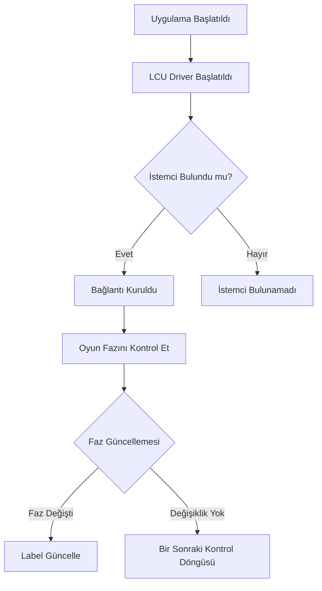

# Otomatik Maç Kabul ve Arama Uygulaması

Bu uygulama, League of Legends istemcisi ile doğrudan etkileşim kurarak oyun durumunu kontrol eder, otomatik olarak maç kabul eder ve karşılaşma arar. Kullanıcıya kolay bir grafiksel arayüz (GUI) sunarak oyun deneyimini otomatikleştiren bir araçtır.

---

## Nasıl Çalışır?

1. **LCU Driver Bağlantısı**
   - League of Legends istemcisine bağlanır ve API aracılığıyla oyun akışını kontrol eder.
   - Oyun durumunu (`gameflow-phase`) sorgular ve GUI üzerinden gösterir.

2. **Kullanıcı Arayüzü**
   - Kullanıcı, GUI üzerindeki checkbox'lar ile otomatik maç kabul etme ve karşılaşma arama özelliklerini açıp kapatabilir.

3. **Otomasyon Süreci**
   - Uygulama, kullanıcı tercihine göre:
     - Otomatik olarak maç kabul eder.
     - Otomatik olarak yeni bir karşılaşma arar.

---

## İş Akışı Diyagramları

### Bağlantı ve Oyun Fazı Kontrolü

---

## Kullanıcı Arayüzü

Uygulama, `customtkinter` kullanılarak geliştirilmiştir ve aşağıdaki unsurları içerir:
- Oyun fazını gösteren bir etiket (`Label`).
- Otomatik maç kabul etme seçeneği için bir checkbox.
- Otomatik karşılaşma arama seçeneği için bir checkbox.

---

## Sorun Giderme

### 1. **İstemci Bağlantısı Sağlanamıyor**
- League of Legends istemcisinin açık olduğundan emin olun.
- Uygulamanın, istemci API'sine erişim iznine sahip olduğundan emin olun.
- Uygulamanın aynı ağda çalıştığından emin olun.

### 2. **Oyun Fazı Güncellenmiyor**
- League of Legends istemcisinde `/lol-gameflow/v1/gameflow-phase` yolunun erişilebilir olduğundan emin olun.
- Uygulamanın yönetici izinleriyle çalıştırıldığından emin olun.

### 3. **API Hataları**
- Uygulama bir `.exe` dosyası halinde olduğu için herhangi bir kütüphane yüklemeye gerek yoktur.
- Eğer uygulama çalışmıyorsa, aşağıdaki adımları izleyin:
  1. League of Legends istemcisini yeniden başlatın.
  2. Uygulamayı yeniden çalıştırın.
  3. Sorun devam ederse uygulamayı yeniden indirin ve yükleyin.

---

## Özellikler

- **Otomatik Maç Kabul**: Kullanıcının müdahalesine gerek kalmadan maç kabul eder.
- **Otomatik Karşılaşma Arama**: Yeni karşılaşmaları otomatik olarak başlatır.
- **Kullanıcı Dostu Arayüz**: Kolay ve basit bir tasarımla seçenekleri kontrol edebilirsiniz.

Bu uygulama, League of Legends oynarken kullanıcı deneyimini geliştirmek ve manuel işlemleri azaltmak için tasarlanmıştır.
