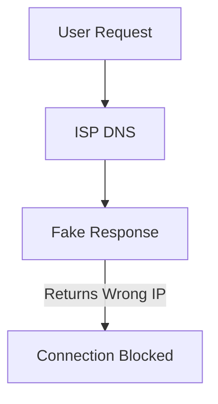

# HelloRedService

**HelloRedService**, Windows üzerinde çalışan bir hizmettir ve aşağıdaki işlevleri yerine getirir:

---

## Özellikler

1. **Discord Bağlantı Yönlendirmesi**  
   HelloRedService, *discord.com* adresine yapılan bağlantıları bir DPI (Derin Paket İnceleme) işlemi ile analiz ederek farklı bir DNS sunucusuna yönlendirir. Bu işlem, Discord bağlantılarının belirli bir DNS yapılandırması üzerinden gerçekleşmesini sağlar.

2. **Normal Trafik Yönetimi**  
   Discord dışındaki tüm ağ trafiği, sistemde varsayılan olarak ayarlı DNS sunucusunu kullanarak çalışır. Bu, diğer tüm internet bağlantılarının normal şekilde işlev görmesini sağlar.

---

## DPI (Deep Packet Inspection) Nedir?

**DPI (Derin Paket İnceleme)**, ağ trafiğini incelemek için kullanılan gelişmiş bir analiz yöntemidir. DPI, bir ağ üzerinden geçen verilerin yalnızca başlıklarını değil, aynı zamanda içeriğini de analiz edebilir. Bu, aşağıdaki amaçlar için kullanılabilir:

- **Trafik Yönlendirme**: Belirli bir uygulama veya web sitesi için özel kurallar uygulayarak ağ trafiğini optimize eder.
- **Güvenlik**: Zararlı içerik, kötü amaçlı yazılım veya şüpheli etkinlikleri tespit edebilir.
- **Sansür veya Kısıtlama**: Belirli içeriklerin engellenmesi veya hızlarının düşürülmesi.

---

## ISS (İnternet Servis Sağlayıcısı) Bağlantıyı Nasıl Engeller?

ISS'ler, DPI teknolojisini veya DNS tabanlı engelleme yöntemlerini kullanarak belirli web sitelerine erişimi kısıtlayabilir. Yaygın yöntemler şunlardır:

### 1. **DNS Zehirlenmesi (DNS Spoofing)**  
ISS, bir alan adının doğru IP adresine çözülmesini engellemek için sahte DNS yanıtları döndürebilir.

**Örnek**:  
Kullanıcı `discord.com` adresine gitmek istediğinde, ISS sahte bir IP adresi döndürerek bağlantıyı keser.

### 2. **Paket Engelleme (Packet Filtering)**  
ISS, ağdaki veri paketlerini analiz ederek belirli bir hedefe (örneğin, Discord) giden trafiği tamamen durdurabilir.

### 3. **Hız Kısıtlama (Throttling)**  
Belirli bir uygulamanın veya sitenin trafiği yavaşlatılarak erişim zorlaştırılır.

---

## DPI Bu Sorunları Nasıl Çözer?

HelloRedService, DPI teknolojisini kullanarak ISS'nin uyguladığı bu kısıtlamaları aşar:

1. **DNS Yeniden Yönlendirme**  
   Discord trafiği için özel bir DNS sunucusu belirlenerek ISS'nin yanlış DNS yanıtlarını aşmak mümkün hale gelir.

2. **Protokol Analizi**  
   DPI, veri paketlerini inceleyerek Discord trafiğini tespit eder ve ISS'nin engelleme mekanizmalarına karşı çözüm üretir.

3. **Şifreli Trafik Yönlendirme**  
   Trafik, şifreli bir protokolle (örneğin, HTTPS veya özel VPN tüneli) yeniden yönlendirilir, bu da ISS'nin içeriği analiz etmesini zorlaştırır.

---

## Bağlantı Sorunları ve Çözümler

HelloRedService çalışırken, belirli durumlarda bağlantı sorunları yaşanabilir. Bu sorunları çözmek için aşağıdaki adımları izleyebilirsiniz:

### 1. **DNS Ayarlarını Kontrol Edin**
   - Sisteminizde DNS ayarlarını doğru şekilde yapılandırdığınızdan emin olun:
     - Discord için kullanılan özel DNS sunucusunun adresini kontrol edin.
     - Varsayılan DNS sunucusunun doğru çalıştığından emin olun.
   - Gerekirse aşağıdaki gibi DNS sunucularını manuel olarak ayarlayabilirsiniz:
     - **Google DNS**: `8.8.8.8` ve `8.8.4.4`
     - **Cloudflare DNS**: `1.1.1.1` ve `1.0.0.1`

### 2. **VPN Ayarlarını Kontrol Edin**
   - Eğer bir VPN hizmeti kullanıyorsanız:
     - VPN bağlantısını kapatın ve Discord’a yeniden bağlanmayı deneyin.
     - VPN, HelloRedService’in özel DNS yönlendirme işlemlerine engel olabilir.

### 3. **Hizmeti Yeniden Başlatın**
   - HelloRedService’in düzgün çalıştığından emin olun:
     1. Hizmeti yeniden başlatın:
        ```bash
        net stop HelloRedService
        net start HelloRedService
        ```
     2. Hizmetin çalışıp çalışmadığını kontrol edin:
        ```bash
        sc query HelloRedService
        ```

### 4. **Firewall Ayarlarını Kontrol Edin**
   - Windows Güvenlik Duvarı ya da başka bir güvenlik yazılımının *discord.com* bağlantılarını engelleyip engellemediğini kontrol edin. Eğer engelleniyorsa, Discord için bir istisna kuralı ekleyin.

### 5. **Log Dosyalarını İnceleyin**
   - HelloRedService, çalışırken bir hata meydana geldiyse, hizmetin log dosyalarını inceleyerek sorunun nedenini öğrenebilirsiniz. Log dosyasının varsayılan konumunu kontrol edin veya yapılandırma dosyalarından ayarları doğrulayın.
### 6. **WinDivert64.sys**
   - **`WinDivert64.sys`** dosyasının silemiyorsanız veya program klasörünü silemiyorsanız (`bu dosya başka bir programda açık olduğundan bu eylem gerçekleştirilemiyor.`). WinDivert64.sys kernelde çalıştığı içindir. 

```
sc stop WinDivert
```
Bu komutu CMD (komut istemcisi) üzerinde çalıştırıp ardından dosyayı silebilirsiniz.


---

## Diagramlar

### 1. ISS'nin DNS Engellemesi

### 2. HelloRedService ile DPI Yönlendirmesi

```mermaid
graph TD
    A[User Request] --> B[HelloRedService DPI]
    B --> C[Custom DNS]
    C --> D[Correct IP Address]
    D --> E[Discord Connection Established]
